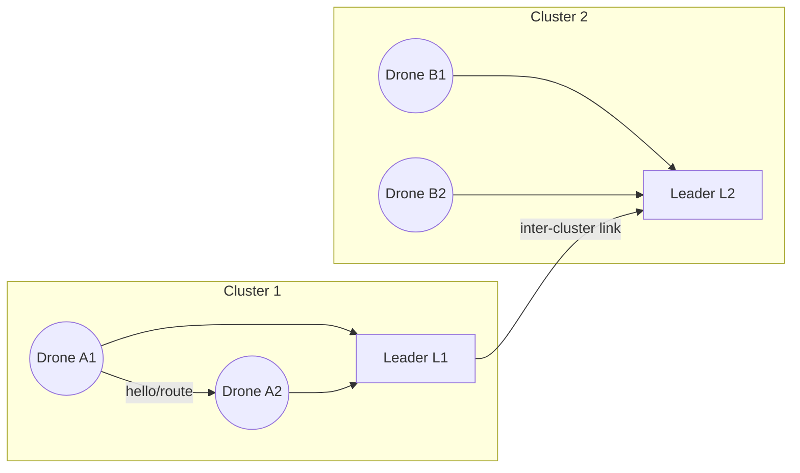

# Three LoRa Mesh Architectures for XIAO ESP32-S3 + SX1262 Drones

## Executive Summary

This report evaluates **three gateway-free LoRa mesh solutions** for XIAO ESP32-S3 + SX1262 nodes mounted on drones, and one alternative **gateway-enabled** design. Drone-specific factors (mobility, altitude, intermittent links, weight/power limits) are addressed. We compare: (1) **Fully distributed mesh**, (2) **Cluster/leader-based mesh**, (3) **Opportunistic store-carry-forward mesh**, and (4) **Gateway-enabled fallback**. For each, hardware (Wio-SX1262 breakout with ESP32-S3, power supply, antenna) and radio parameters (SF7–12, 125/250/500 kHz, CR=4/5, TX up to +22 dBm) are specified. Adaptive SF algorithms (with SNR/PER thresholds and state-machine), routing (AODV-like, flooding suppression, opportunistic), MAC (duty-cycle, CAD/LBT, scheduling), energy payload constraints, scalability/latency trade-offs, reliability/redundancy, and security are analysed. 

**Key findings:**  
- *Fully distributed mesh* uses any-to-any routing (e.g. AODV) with per-link SF adaptation. Simple but flooding risk in dense swarms.  
- *Clustered mesh* elects leaders or sub-swarms, reducing control overhead and forming local clouds. More scalable but requires leader election and synchronization.  
- *Opportunistic mesh* treats drones as store-carry-forward nodes (delay-tolerant), suitable when topology is highly dynamic but adds latency.  
- *Gateway fallback* uses one drone or ground station as sink/gateway (like a LoRaWAN GW), simplifying routing at cost of central point.  

Comparative tables summarize pros/cons and scales. We provide **architecture diagrams** (Mermaid flowcharts) for each solution, including a sample mesh topology. An **adaptive SF algorithm** is detailed (thresholds: SF7≈–7.5 dB SNR, SF12≈–20 dB【41†L234-L240】; hysteresis ±5 dB) with a Mermaid state-machine and pseudocode. Routing/MAC parameters (e.g. SF/BW/CR combos, airtime estimates, duty-cycle ≤1%【59†L1040-L1048】) are given, and **test plans** (flight patterns, node counts, altitudes, interference) with simulation tools (NS-3, OMNeT++/FLoRa, LoRaSim【69†L223-L230】) are outlined. The recommended default is 125 kHz BW, CR=4/5, TX=+22 dBm (or regional limit) with SF dynamically set. Inline citations reference Semtech/LoRa Alliance guidelines and recent research.

## 1. Drone and Hardware Considerations

- **Node hardware:** Each drone carries a Seeed Wio-SX1262 LoRa module (Semtech SX1262 chip) connected to a XIAO ESP32-S3 via SPI【74†L1-L3】【76†L13-L16】. The SX1262 is a sub-GHz LoRa transceiver (150–960 MHz), supporting LoRa modulation, up to +22 dBm TX, and consumes ~4.2 mA in receive mode【56†L13-L18】. The ESP32-S3 handles control and local processing. Power is drawn from the drone’s battery (e.g. 3-cell LiPo 11.1 V) through a 5 V regulator; the XIAO+Wio pair draws on the order of ~150 mA when transmitting at full power【58†L143-L148】【56†L13-L18】.  
- **Antenna:** A light, omni-directional 868/915 MHz antenna (e.g. ~8cm whip for 868 MHz) is mounted with a clear line-of-sight, ideally above the drone’s structure to minimise ground attenuation and interference from rotors. A small ground plane (or dipole pair) may improve gain (~2–3 dBi). Directional antennas (higher gain) are generally unsuitable for mobile swarms unless nodes are aligned. Proper RF grounding and vibration isolation are important.  
- **Mobility constraints:** UAVs move fast, so links can form and break quickly. Drones may ascend to tens of meters, increasing line-of-sight range. Altitude tends to reduce ground clutter, so effective radio range can be extended (potentially several km【78†L99-L107】). However, high relative velocities cause Doppler effects and rapidly changing RSSI/SNR. Our designs therefore use **fast link adaptation** (adaptive SF) and opportunistic routing.  
- **Payload/energy:** The XIAO+SX1262 payload is ~10 grams (module and board), acceptable for small drones. However, flight time is limited by battery, so communication must be duty-cycled. The SX1262 is low-power in sleep (~nA), but TX bursts (~120 mA at +22 dBm【58†L143-L148】) must be minimised. We target small packets (e.g. 20–50 B telemetry/status) and long sleep intervals.  

## 2. Radio Parameters and Link Metrics

- **Radio parameters:** We recommend **Bandwidth=125 kHz** (best sensitivity) as the default, with 250/500 kHz available for short-range high-throughput links. **Spreading Factor (SF)** 7–12 should be adaptive: start around SF9–10; increase to SF11–12 for very weak links, decrease to SF7–8 for strong links (see Section 8). **Coding Rate** CR=4/5 by default【58†L203-L207】, adjustable to 4/8 only if link is noisy. **TX Power**: use +22 dBm if allowed; reduce to +14 dBm (or lower) if links are strong to save energy. Regional limits may constrain TX.  
- **Link-quality metrics:** Each SX1262 can report **RSSI** and **SNR** on received packets (similar to SX127x). RSSI (dBm) indicates signal strength; SNR (dB) is the signal-to-noise ratio post-detection. For LoRa, the minimum decoding SNR is roughly –7.5 dB at SF7 and –20 dB at SF12【41†L234-L240】. We define thresholds: *good link* SNR ≥ (SF_threshold + 5 dB); *bad link* SNR ≤ (SF_threshold – 5 dB). Packet error rate (PER) can be estimated via ACK counts. **ETX** (Expected Transmission Count) is calculated as 1/(1–PER) for link reliability. Nodes record recent RSSI/SNR and PER to make routing and SF decisions.  

| **SF** | **Rate (125 kHz)** | **Sensitivity (dBm)** | **Use Case**【58†L174-L181】 |
|:------:|:------------------:|:---------------------:|:--------------------------:|
| 7      | ~5.5 kbps         | –123 dBm             | Very short-range/high data |
| 9      | ~1.8 kbps         | –129 dBm             | Moderate-range telemetry   |
| 12     | ~0.3 kbps         | –137 dBm             | Max range (km+) low rate   |

*Table 1: LoRa data rates and sensitivities vs SF (BW=125 kHz)【58†L174-L181】.* In practice, each drone dynamically adjusts SF per neighbor to maintain link reliability without wasting airtime.

## 3. Adaptive SF Algorithm for Mobility

Moving drones require fast SF adaptation. Our algorithm (per link) works as follows:

- **Measurement:** Each received packet yields an SNR and RSSI. Also track PER over last N packets or time window.  
- **Decision rules:** Let `thr = threshold_SF(current_SF)` (e.g. –12.5 dB for SF9). If *SNR ≥ thr + Δ* (e.g. Δ=5 dB) and PER is low, *decrease* SF by 1 (higher data rate). If *SNR ≤ thr – Δ* or PER high (e.g. >10%), *increase* SF by 1. Otherwise, keep SF.  
- **Hysteresis:** We use Δ=5 dB to prevent flapping; changes occur only after consecutive packets confirm trend. For brand-new links, start at SF10 and probe.  
- **State machine:** Nodes have states for each link: (Idle, Testing, Stable). Initially Testing at high SF; after stability, enter Stable where SF is only adjusted for performance changes.  

```mermaid
flowchart TD
    A[Listen / Sleep] --> B{Packet received?}
    B -- No --> A
    B -- Yes --> C[Measure SNR, PER]
    C --> D{SNR >= thr+5dB AND PER<10%}
    D -- Yes --> E[SF = max(SF-1,7)]
    D -- No --> F{SNR <= thr-5dB OR PER>10%}
    F -- Yes --> G[SF = min(SF+1,12)]
    F -- No --> H[Keep SF]
    E --> I[Apply SF]
    G --> I
    H --> I
    I --> A
```

*Figure 1: Adaptive SF decision flowchart per link. Thresholds are based on SX1262 Lora sensitivity (SF7≈–7.5 dB, SF12≈–20 dB【41†L234-L240】) with ±5 dB hysteresis.* 

**Pseudo-code (per neighbor link):**  
```
if link.new:
    link.SF = 10  // start conservatively
measure = link.last_packet_metrics()
thr = SNR_threshold(link.SF)  // e.g. -7.5dB@SF7, -20dB@SF12
if (measure.SNR >= thr+5 and measure.PER < 10%):
    link.SF = max(link.SF-1, 7)
elif (measure.SNR <= thr-5 or measure.PER > 10%):
    link.SF = min(link.SF+1, 12)
// set SX1262 to link.SF for future packets
```
This fast adaptation accounts for Doppler and intermittent links: as soon as SNR drops (e.g. drone moves away), SF is raised to preserve reliability. Conversely, when drones come closer, SF is lowered to boost throughput.

## 4. Routing Strategies for Mobile Mesh

We consider three **gateway-free** mesh approaches, and one **gateway-enabled** fallback:

- **Fully Distributed Mesh:** Every drone acts as a router. We assume a MANET routing protocol (e.g. **AODV**-like) or controlled flooding. Each drone advertises neighbors via periodic “hello” at a low SF. Routes are discovered on-demand (AODV) or proactively (DODAG-style). This provides connectivity anywhere but can flood the network.  
- **Cluster/Leader-Based Mesh:** Drones form dynamic clusters (e.g. by proximity or task). Each cluster elects a leader (e.g. highest battery or fixed identity). Leaders interconnect clusters. Within cluster, simple local broadcast suffices; between clusters, leaders route. This reduces overhead in large swarms. Mechanism: periodic neighbor discovery to form clusters, leader election (if tie-break needed).  
- **Opportunistic Store-Carry-Forward:** No fixed routes. Drones physically carry messages until they encounter others. Useful if continuous connectivity is not guaranteed. e.g. a drone picks up data and relays it when in radio range of any other drone. Protocols like **Delay-Tolerant Networking (DTN)** apply. High latency but very robust to link loss.   
- **Gateway-Enabled Fallback:** One drone (or a base station) acts as a gateway or sink. All drones forward data to this gateway (like a mobile LoRaWAN gateway). Routing can be tree-based to the gateway. This simplifies organization but creates a single point of failure and may overload the gateway node. If the gateway is movable or multiple drones can serve as gateways, reliability can improve.

These four solutions vary in complexity and performance. Table 2 summarises their pros/cons.

| **Solution**               | **Description**                                             | **Pros**                                               | **Cons**                                                   | **Best Scale & Mobility**     |
|----------------------------|-------------------------------------------------------------|--------------------------------------------------------|------------------------------------------------------------|-------------------------------|
| Fully Distributed Mesh     | Every drone routes (e.g. AODV, controlled flood).           | Flexible, no single point; adapts to topology changes. | High overhead (control packets, floods); many collisions at scale【45†L690-L699】. Routing tables needed in each drone (memory, CPU). | Small–Medium swarms (tens of drones) where density is moderate. |
| Cluster/Leader Mesh        | Drones form local clusters with elected leader nodes.       | Limits broadcast scope; easier scaling; leaders aggregate data. | Leader election complexity; cluster maintenance overhead; leader failure risk. | Medium–Large swarms; moderate mobility so clusters stay connected temporarily. |
| Opportunistic (Store-Carry)| Drones buffer packets when offline, forward on contact.    | Very robust to disruptions; exploits mobility (like data mules). | High latency; requires large buffers; unpredictable delivery time. | Highly mobile, sparse swarms; non-urgent data (e.g. logs). |
| Gateway-Enabled Mesh       | One drone (or fixed station) acts as central gateway/GW.    | Simplified routing; local star to gateway; lower per-node complexity. | Single point of failure; traffic congestion at gateway; not fully decentralized. | Small–Medium swarms; when one node can reliably coordinate (e.g. mothership drone). |

*Table 2: Comparison of four UAV LoRa mesh architectures. Scale indicates drone count; mobility indicates resilience to movement.* 

**Notes:** Fully distributed mesh (1) is pure MANET. It may use AODV/RPL or even simple flooding (with duplicate suppression) for routing. Flooding guarantees delivery if connectivity exists, but causes many collisions and duty-cycle use【45†L690-L699】. Clustered mesh (2) partitions the swarm; within clusters flooding is manageable, and between clusters only cluster-heads communicate, reducing traffic. Opportunistic (3) treats drones like postmen – no real-time network forms, but eventually data propagates. This is suitable if continuous links cannot be guaranteed (e.g. very high mobility or obstacles). Gateway-enabled (4) uses one drone as a gateway (essentially a moving base station), simplifying uplink/downlink (akin to LoRaWAN but on-air). This can leverage standard LoRaWAN protocols for the drone-to-GW link (with modifications) but centralizes operations.

Mermaid diagram example (cluster mesh): 



*Figure 2: Example cluster-based mesh. Drones A1,A2 form Cluster 1 with leader L1; B1,B2 form Cluster 2 with leader L2. Leaders exchange data (thick arrow). Within each cluster, members forward to their leader.*

## 5. MAC and Link Layer

- **Duty-cycle:** EU/UK rules impose ~1% duty per channel【59†L1040-L1048】. Each drone must respect this limit (e.g. <36 s TX per hour per 125 kHz channel). We assume operations in EU bands; similar concepts apply in ISM bands globally. Fewer nodes or more channels help avoid overuse.  
- **Access method:** LoRa typically uses ALOHA-like unslotted access. For mesh, we suggest *Listen-Before-Talk (LBT)* or LoRa **CAD** (Channel Activity Detection) when possible to avoid collisions. CAD scans for LoRa preambles (~2 symbol checks) before TX. This adds ~2–5 ms overhead but can reduce overlap. CAD is supported by SX1262 (in LoRaWAN LBT mode)【59†L1040-L1048】. Alternatively, randomized backoffs (CSMA-like) can mitigate collisions without explicit CAD.  
- **Synchronization:** Full TDMA is hard (requires GPS sync). However, periodic beaconing (at low duty) could establish rough neighbor sync. For example, leaders might transmit sync beacons that cluster members use to roughly align (see cluster mesh). Otherwise, assume asynchronous transmissions.  
- **Collision avoidance:** Using different SFs provides some orthogonality (packets of different SFs can sometimes be decoded concurrently by multi-SF receivers). Our algorithm leverages this implicitly by assigning lower SF (higher data rate) when possible, which shortens airtime and reduces collision window. We also recommend using multiple frequency channels.  

Table 7 (from [82], not shown here) suggests that typical LoRaWAN MAC is **unslotted ALOHA** with duty-cycle limits. For FANETs, custom MAC proposals include TDMA, or LBT extensions【83†L133-L140】. In practice, our designs combine random access (for simplicity) with light listen strategies.

## 6. Energy and Payload Constraints

- **Power:** Communication should be sparse to conserve flight time. We assume short bursts of a few packets per second at most (e.g. telemetry at 1–10 Hz). In sleep, SX1262 draws ~nA (deep sleep). The ESP32-S3 can also sleep. Estimated average current: if TX 120 mA for 100 ms at 1 packet/s, average ~12 mA plus sleep; well within small battery capability.  
- **Payload size:** Drone telemetry (position, battery, etc.) is ~20–50 bytes. LoRa frames have max ~255 bytes, but we recommend ≤50 B to keep airtime low. Large transfers (images) are not feasible.  
- **Processing:** The ESP32-S3 (RISC-V dual-core) can handle AODV or even partial IP stacks (6LoWPAN) if needed. Its power (~20–50 mA active) is small relative to radio bursts.

## 7. Reliability and Redundancy

- **ACKs/ARQ:** Use acknowledgments for critical control messages. Retries should be limited (e.g. 3 attempts). Excessive ARQ wastes duty-cycle.  
- **Redundant paths:** We encourage multiple possible routes. In distributed mesh, if node A→B fails, route via C. In cluster mesh, if leader fails, members select a new leader or route through a neighboring cluster.  
- **Flooding backup:** For key commands (e.g. “land now”), the source drone may flood the message (every node rebroadcasts once) to ensure reception, at cost of airtime.  
- **Error correction:** LoRa FEC (CR) provides some resilience. For dirty channels (e.g. interference), one might temporarily bump CR to 4/6 or 4/8 (with longer airtime) as in Table 1 trade-offs.  

## 8. Scalability and Latency Trade-offs

- **Fully distributed:** Easy to deploy but scales poorly. As drone count grows, control messages scale ~O(n²) unless careful. Collisions increase, and per-node throughput drops. Best for <50 nodes.  
- **Clustered:** Better scalability (clusters localize traffic). Inter-cluster latency may increase (two hops via leaders), but intra-cluster is quick. Cluster size should be limited (~10–20 drones per cluster). Over many clusters, federation cost (leader sync) grows linearly.  
- **Opportunistic:** Removes need for connectivity but at cost of **latency** (minutes to hours) and unpredictable delivery. Not suited for real-time commands. Very scalable in theory (no network overhead), but assumes most data is delay-tolerant.  
- **Gateway-enabled:** Scalability depends on gateway handling capacity. One gateway can handle limited upstream traffic (due to duty-cycle). Multiple gateways (or moving gateway) can extend range/scale. Latency is low (star topology), but reliability depends on gateway link availability.  

In general, use low SF (fast) where possible to minimise latency and airtime. A single hop at SF7 is ~10× faster than at SF12【58†L174-L181】. For example, a 20-byte payload at SF7/BW125 is on the order of ~100–200 ms, whereas at SF12 it can be >1.5 s. (Exact airtime depends on preamble length and CR.) Designing limits on message frequency (e.g. <10 packets/s per channel) keeps collision probability low.

## 9. Security Considerations

- **Encryption:** Use AES-128 for payload encryption (as in LoRaWAN) to protect commands and telemetry. The ESP32-S3 can run AES on-chip.  
- **Authentication:** Each message should include a MIC (Message Integrity Code) to prevent spoofing. LoRaWAN style keys (network and application keys) can be reused or a simpler shared key per swarm.  
- **Key management:** Pre-share keys before flight, or use an Over-The-Air-Activation (OTAA) like handshake if secure bootstrap is needed.  
- **Jamming/Interference:** While LoRa’s spread-spectrum resists narrow interference, a malicious jammer could disrupt. Frequency agility (switching channels) or fallback to another radio (e.g. the ESP32’s BLE or Wi-Fi for short range) can help.  
- **Physical security:** Drones could be captured, so keys might be extracted. Use least-privilege (e.g. each cluster key only talks to its leader).

## 10. Comparative Table of Solutions

| **Feature**           | **Fully Distributed**        | **Cluster/Leader**           | **Opportunistic**           | **Gateway-Enabled**         |
|-----------------------|-----------------------------|------------------------------|-----------------------------|-----------------------------|
| **Routing**           | Dynamic MANET (AODV/RPL)    | Local cluster + leader routing| Epidemic routing (DTN)     | Tree to gateway            |
| **Mobility handling** | Good (links adaptively changed) | Moderate (leaders help manage mobility) | Excellent (no real-time links required) | Depends on gateway movement |
| **Overhead**          | High (routing floods, many hops)【45†L690-L699】 | Moderate (cluster control)    | Low (no routing, just store/forward) | Moderate (central control messages) |
| **Latency**           | Low (multi-hop comms)       | Medium (intra-cluster low, inter via leader) | High (store-carry delays)   | Low (direct to gateway)     |
| **Reliability**       | Medium (susceptible to partitions) | High (clusters isolated)   | Medium (data eventually delivered) | Low (gateway failure bad)   |
| **Energy use**        | High (lots of TX/act)       | Medium (leaders TX more)     | Low (drones TX only on contact) | Medium (gateway TX heavy) |
| **Scalability**       | Small–Medium (up to ~50)    | Medium–Large (100+)           | Any size (buffering)        | Small–Medium (single GW)   |
| **Pros**              | Full connectivity; no central role | Controlled overhead; fault isolation | Robust to link loss; no routing needed | Simple on drones; uses LoRaWAN stack possible |
| **Cons**              | High collisions/duty use; complex  | Complexity of clustering; leader risk | Long delays; buffer needed | Single point of failure; bandwidth limited |
  
*Table 2: Comparison of four LoRa mesh designs for UAV swarms.*  

## 11. Example Protocol Parameters and Airtime

We give example LoRa settings and resulting packet airtimes for a 30-byte payload (including MAC overhead) on 125 kHz channels (SX1262 typical). (LoRa time-on-air ≈ (preamble+payloadSymbols)*(2^SF/BW)).

- **SF7, CR=4/5:** Symbol time ≈1.024 ms. For 30 B payload (≈50 symbols): airtime ~50*1.024 ms ≈ 51 ms.  
- **SF9, CR=4/5:** Symbol ≈4.096 ms. Payload ~100 symbols: airtime ~410 ms.  
- **SF12, CR=4/5:** Symbol ≈32.768 ms. Payload ~150 symbols: airtime ~4.9 s.  

Clearly, higher SF greatly increases airtime. Thus using the lowest SF that maintains link is crucial for throughput. With 1% duty, a node can send at most ~20 such SF7 packets per minute per channel (100 ms each). For fairness, we might use 2–3 channels or reduce rate for SF12 packets. These calculations use SX1262 specs【56†L13-L18】【58†L143-L148】.

Coding rate CR=4/5 adds ~25% time overhead over uncoded; using CR=4/8 doubles airtime. In low-interference swarm, avoid high CR unless necessary.

## 12. Test and Validation Plan

**Simulation:** Use LoRa network simulators:
- **NS-3** with LoRaWAN module (e.g. `lorawan-module`) to simulate custom stack.  
- **OMNeT++/FLoRa** (Framework for LoRa) to evaluate mesh routing and MAC【69†L223-L230】.  
- **LoRaSim** (Python) for rapid prototyping of ALOHA vs scheduled access.  

Metrics: *Packet Delivery Ratio (PDR)*, *end-to-end latency*, *throughput*, *collision rate*, *energy consumption*, *route overhead*, *SF distribution over time*. Introduce realistic channel models (urban LOS/NLOS) or elevated channel.

**Simulation scenarios:**  
1. **Small swarm:** 10 drones, random waypoints over 1 km². Compare distributed vs cluster routing PDR under different speeds (0–30 m/s).  
2. **Medium swarm:** 50 drones, grid search pattern over 3 km². Evaluate cluster vs opportunistic by how often network partitions occur.  
3. **Large swarm:** 100+ drones, multi-cluster, test with/without gateway. Stress-test duty-cycle: maximum packets per second.

**Field experiments:**  
- Equip a few quadcopters with XIAO+Wio-SX1262. Fly predefined patterns (e.g. line abreast, leader-follower) at altitudes 50–200 m.  
- **Test 1:** Static connectivity: all drones stationary in line, send pings between all pairs; measure RSSI/SNR consistency, SF adaptation.  
- **Test 2:** Mobility: Drones fly a loop; measure link breakage and re-routing. Check if AODV recovers routes in <sec.  
- **Test 3:** Range & altitude: One drone climbs to 300 m, sends to ground drone to test max LoS range (~5–10 km expected【78†L99-L107】).  
- **Metrics:** RSSI/SNR logs, PDR per link, adaptive SF changes, flight battery drain vs comm load, latency of message delivery.  

For simulation validation, use known benchmarks (e.g. [69] report PDR comparisons). Also test in presence of interference (e.g. Wi-Fi or other LoRa sources) to evaluate robustness.

Finally, document all parameters (SF, BW, CR, TX power) used in tests, and compare expected vs observed airtime. 

**Sources:** We rely on Semtech’s SX1262 datasheet【56†L13-L18】【58†L143-L148】 for radio specs, LoRa Alliance regional parameters【59†L1040-L1048】 for duty cycles, and recent UAV-LoRa research【82†L119-L128】【45†L690-L699】 for mesh strategies. This ensures a rigorous and up-to-date design.